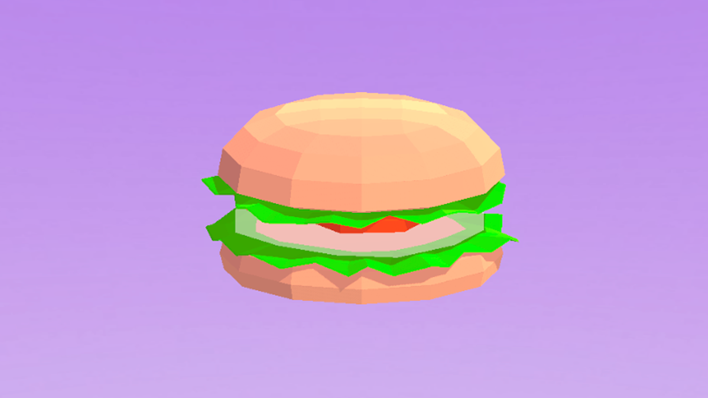
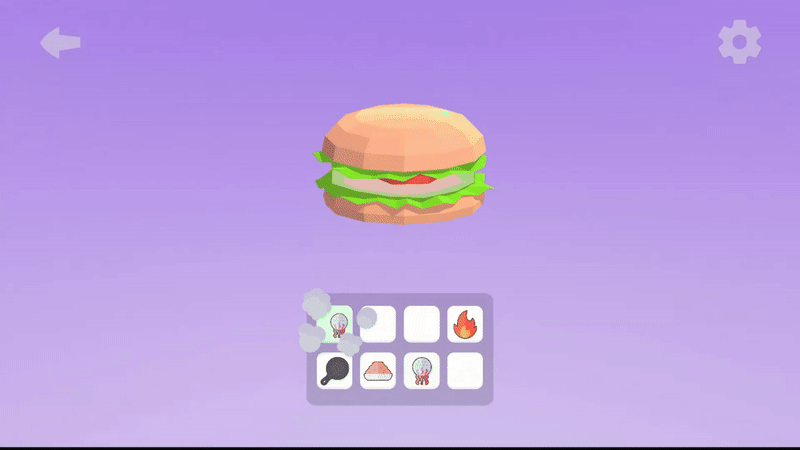

# Merge Game (Legacy Project) 🧩

An archived **2D merge game** project originally created for **Yandex Games**.

### About the Project
- **Engine:** Unity  
- **Language:** C#  
- **Platform:** WebGL (Yandex Games)

## 📸 Screenshots

### Description
This is one of my early game development projects.  
The game is a relaxing 2D merge experience focused on **fast food cooking**:
players merge ingredients to create complete meals across **10 levels**.

This project was mainly a learning experience where I practiced:
- Merge-based gameplay logic  
- Progression systems  
- Integration with the Yandex Games SDK  

The code is preserved in its original state as part of my personal development history.

### Status
🗃️ **Legacy / Archive project**  
No active development — kept for documentation and personal growth tracking.

---

**NuerisCore**  
Physics • AI • GameDev  

Game : [[YGames]([https://t.me/fomooe](https://yandex.ru/games/app/372838?draft=true&lang=ru))]
YouTube: [[MyYouTube Channel](https://youtube.com/channel/UC9tkLMP-mpi883nc5ktMYNg)]  
Telegram: [[MyTelegram](https://t.me/fomooe)]
